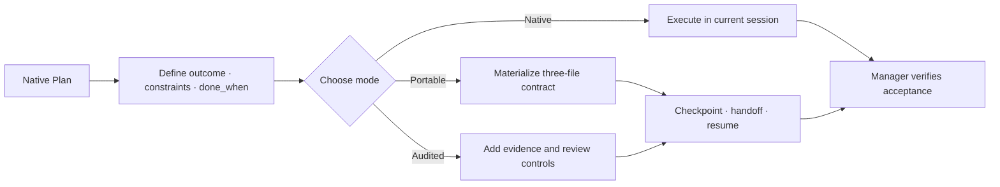

<div align="center">

# Agent Harness

**Runtime-neutral continuity and acceptance controls for AI coding agents.**

[简体中文](README.zh-CN.md) · English

[](https://github.com/SUNRNEHUI/agent-harness/releases) [](https://github.com/SUNRNEHUI/agent-harness/actions/workflows/ci.yml) [](https://www.python.org/downloads/) [](LICENSE)

</div>

Current version: **v10.0.0** · 2026-08-27

Agent Harness is a Plan-native skill for reliable execution across Codex,
Claude Code, Grok, and other file-and-shell capable agents. It uses the runtime's own Plan
for ordinary work, materializes a compact provider-neutral contract only when work must
survive a boundary, and adds audit controls only when risk requires them.

**Choose the lightest mode that fits**

| Need | Mode | Durable state |
| --- | --- | --- |
| Finish and verify in the current session | **Native** | None; use the runtime Plan |
| Survive a session/model boundary or external wait | **Portable** | `contract.json`, `events.jsonl`, `capsule.md` |
| Prove high-risk, release, security, or production work | **Audited** | Portable state plus justified evidence and review controls |

**Quick start**

```bash
npx skills add https://github.com/SUNRNEHUI/agent-harness --skill "agent-harness"
```

[Overview](#overview) · [Execution modes](#execution-modes) · [Download](#download) · [Installation](#installation) · [Release history](#release-history) · [Documentation map](#runtime-adapters)

## Start With Alignment

The high-leverage part of Agent Harness happens before any worker starts. It acts as a
translator between a rough intent and an executable task: it makes hidden assumptions visible,
then turns the request into a short, reviewable alignment packet.

Before implementation, the manager clarifies the user-facing outcome and system `done_when`,
scope and ownership, constraints and non-goals, relevant edge cases and approval boundaries, and
the evidence and pass rule for each acceptance criterion. Low-risk gaps can receive a stated
recommended default; a material choice stays an explicit decision instead of becoming a silent
assumption.

You do not need to arrive with a complete task breakdown. Describe the rough goal, then say:

```text
I want to [rough goal]. Write a harness first so we can align the work before implementation.
```

The agent first returns the alignment packet for review. It starts work only after the outcome,
boundaries, and acceptance evidence are clear enough to execute honestly. “Write a harness” is
an alignment request, not an automatic instruction to create durable files, select a heavyweight
mode, or dispatch sub-agents.

## Download

Use the [GitHub Releases](https://github.com/SUNRNEHUI/agent-harness/releases) page as the
source of truth. The v10.0.0 runtime package is published as
`agent-harness-v10.0.0.zip`; the direct download and checksum assets are:

- [Download agent-harness-v10.0.0.zip](https://github.com/SUNRNEHUI/agent-harness/releases/latest/download/agent-harness-v10.0.0.zip)
- Checksum asset: `agent-harness-v10.0.0.zip.sha256`
- [Open the v10.0.0 release page](https://github.com/SUNRNEHUI/agent-harness/releases/tag/v10.0.0)

> **v10.0.0 highlights:** the project and skill are now named **Agent Harness** /
> `agent-harness`; explicit “write a harness” requests first compile an intent-to-contract
> alignment packet and readiness gate; public Draft 2020-12 schemas keep their payload format
> while moving to the `urn:agent-harness:` namespace; and the v9.4 behavior is included.

---

## Overview

Modern agents already plan, track tasks, use tools, and manage workers. Repeating those
capabilities in a second prompt-level state machine wastes context and creates competing
sources of truth. This skill adds only what a runtime cannot reliably carry across a
session or model boundary.

The manager remains responsible for:

- selecting Native, Portable, or Audited mode
- defining the outcome, constraints, approval boundaries, and observable `done_when`
- materializing only facts that are expensive or unsafe to reconstruct
- choosing a proportional implementation route: parent-direct for a v3 micro change only after
  explicit scope/risk/context/verification/cost confirmations, one bounded worker for ordinary or
  heavy work, and parallel workers only when complex module ownership is disjoint
- stopping reasoning loops that produce no observable progress
- verifying acceptance evidence before claiming completion

Sub-agents are used only for bounded execution, investigation, review, or evaluation tasks. They do not replace the manager's responsibility for final acceptance.

---

## Core Capabilities

- **Plan-native routing:** reuse the runtime Plan instead of generating a second checklist.
- **Portable Contract v2:** preserve only objective, decisions, milestones, blockers, next
  action, workspace fingerprint, evidence digests, capabilities, and tiered reads.
- **Bounded resume context:** regenerate `capsule.md` under a deterministic character budget.
- **Fail-closed continuation:** detect corruption, drift, stale ownership, multiple active
  runs, and Portable/legacy ambiguity before mutation.
- **Audited extensions:** retain typed receipts, Production State Witness, protected TDD
  chronology, evaluator separation, and stronger fencing for high-risk work.
- **Legacy compatibility:** continue to validate and resume `handoff-v1` Full artifacts.
- **Adapter-local routing:** keep provider and model slugs outside the portable core; use a
  configured `luna_worker` only for bounded execution that benefits from dispatch.
- **Progress Circuit Breaker:** require new evidence, an artifact change, a test result, or a
  binding decision that advances a named acceptance boundary; stop after two no-progress
  cycles without a new diagnosis.
- **Composable engineering workflow:** reuse active repository instructions or an available
  matching coding skill for implementation and verification; do not copy or require a named
  companion skill.
- **Complexity-proportional execution:** a v3 micro implementation can stay parent-direct only
  after explicit, auditable confirmations; ordinary or execution-heavy implementation uses one
  bounded worker; complex work uses parallel workers only at independent module boundaries, while
  tightly coupled writes stay serial or under one owner.
- **Lean packaging:** exclude duplicate prompts, repository tests/evals, generated
  `.harness/` and `workspace/` artifacts, caches, sessions, and private configuration.

---

## Execution Modes

| Mode | Use When | Durable State |
| --- | --- | --- |
| **Native** | The active session can finish and verify without costly reconstruction. | None; use the runtime Plan and task tracking. |
| **Portable** | Work may cross sessions/models, wait externally, or use workers whose results must survive context loss. | `.harness/<slug>/contract.json`, `events.jsonl`, `capsule.md` |
| **Audited** | Production, release, permissions, security, destructive changes, disputed ownership, or high fake-success risk needs stronger proof. | Portable state plus justified evidence and review extensions; legacy Full remains supported. |

Delegation is independent of mode. Native, Portable, and Audited choose persistence and
evidence depth; they do not turn a micro implementation into a larger workflow. A v3 micro,
local, low-risk, context-complete implementation that one short verification cycle can prove and
costs more to delegate may stay parent-direct only with explicit confirmations for those facts and
no protected boundary. The confirmations are routing assertions, not automatic proof; the parent
must verify them. Ordinary or execution-heavy implementation uses one bounded worker. Complex
work uses multiple agents only at independent module or ownership boundaries whose benefit exceeds
coordination cost; tightly coupled writes remain serial or have one owner. Explicit user
delegation overrides the micro direct choice.

---

## When To Use

Use this skill when the request involves:

- saying "You are the main agent" or "write a harness" to activate one mode gate
- writing a harness to solve this problem
- durable handoff or cross-model continuation
- resumable execution or a long external wait
- multi-agent, sub-agent, parallel, DAG, or worktree coordination
- 分头处理 / 分别派 / 拆给不同 agent
- evidence-based acceptance or a high fake-success risk

The trigger selects the skill, not the heaviest mode. Ordinary implementation can remain
Native when the repository workflow is sufficient. A qualifying v3 micro implementation may run
directly in the parent only after its six confirmations; ordinary/heavy implementation uses one
bounded worker when dispatch is available, and complex implementation is parallel only across
independent ownership boundaries.
Planning, review, and non-implementation work may stay in the parent thread when coordination
costs more than execution. Mechanical batch work is a separate bounded route, not a synonym for
micro implementation.

---

## Operating Flow



The manager should choose the lightest mode that preserves safe execution and honest
completion. Do not mirror a native Plan into JSON or Markdown.

Use `define-goal` or an available durable goal tool only when the user requests goal-backed
execution or the stopping condition is not measurable yet. Goal definition does not itself
authorize Portable state, Audited controls, or a worker.

## Progress And Codex Routing

Progress means new evidence, an artifact change, a test result, or a binding decision that
advances a named `done_when` criterion or critical-path blocker. Generated reports, package
rebuilds, inventory, and auxiliary checks do not count unless that criterion requires them.
After two no-progress cycles, run one falsifying experiment; if it yields no evidence, stop
that reasoning chain.

When explicit Codex routing is available, the parent/main Agent uses Sol `high` for the goal,
short plan, dispatch, status, integration, acceptance, and confirmed v3 micro implementations. A
locally installed `luna_worker` may run Luna `max` for ordinary or execution-heavy implementation.
Explicit user delegation selects that worker even for a micro-looking change. Simple mechanical
batch work remains a separate bounded route. Complex work is parallel only across independent
modules, and tightly coupled writes remain serial or have one owner. Custom-agent calls use a
self-contained `fork_turns=none` task; workers are leaves and do not recursively delegate.
Saying "main agent" does not prove a worker or model ran. If Luna or a requested implementation
model is unavailable or cannot be resolved, try another verifiable bounded worker; if none is
available, block implementation unless the user explicitly authorizes parent direct fallback.
Keep requested versus resolved models separate. Review starts only after a concrete candidate
exists, and retry requires a new diagnosis or evidence.

---

## Portable And Audited Protocol

Portable v2 is the default durable protocol. Audited controls are extensions, not a second
mandatory workflow.

### 1. Materialize A Contract

Materialize only after the native Plan is actionable and a durability trigger exists:

```bash
python3 <skill-dir>/scripts/harnessctl.py materialize . \
  --title "Checkout refactor" \
  --goal "Complete the checkout refactor without changing public behavior" \
  --done-when "Focused and regression tests pass" \
  --constraint "Preserve unrelated changes" \
  --next-action "Inspect the checkout state boundary"
```

This creates exactly three core files under `.harness/<slug>/`:

- `contract.json`: the only mutable source of truth
- `events.jsonl`: append-only transition and evidence index
- `capsule.md`: bounded, regenerated context for the receiving model

### 2. Checkpoint Verified Boundaries

Checkpoint after a meaningful verified result or before a likely interruption, not after
every tool call. Evidence remains in the project; the contract stores only a relative path,
SHA-256 digest, and size.

```bash
python3 <skill-dir>/scripts/harnessctl.py checkpoint . \
  --runtime codex --actor-id codex-main --owner-epoch 1 \
  --completed "Focused regression passes" \
  --next-action "Run the package verification" \
  --evidence-file reports/focused-test.txt \
  --reason "Verified implementation boundary"
```

The first checkpoint claims epoch 1 and omits `--owner-epoch`.

### 3. Handoff And Resume

Use `handoff` for a clean transfer. The replacement runtime starts from the project root:

```bash
python3 <skill-dir>/scripts/harnessctl.py resume . \
  --runtime claude --actor-id claude-main
```

`resume` validates the contract, rejects ambiguous active Portable/Full state, checks
workspace drift, transfers ownership, regenerates the capsule, and returns `must_read`,
`read_if_needed`, blockers, pending verification, and one safe next action. An abrupt active
owner takeover additionally requires `--takeover-reason`.

At a terminal boundary, run `close --status accepted|failed|cancelled`. Accepted closure
requires evidence and no unresolved blocker or pending verification; closed contracts no
longer participate in active-run selection.

### 4. Portable Data Boundary

Persist observable facts only: goal, `done_when`, constraints, completed milestones,
blockers, decisions with short rationale, changed paths, evidence digests, capabilities,
and tiered reads. Do not persist hidden reasoning, full chats, provider session objects,
secrets, or in-flight external side effects.

### 5. Audited Escalation

Add only the control required by the risk:

- typed acceptance receipts and manager re-verification
- Production State Witness for UI/state/async/concurrency paths
- protected RED/GREEN chronology for behavior changes
- evaluator separation, stronger rollback, and detailed trace
- owner epoch fencing for disputed or concurrent writers

Audited does not imply parallel workers. Worker use remains an independent cost/ownership
decision.

### 6. Legacy Full Compatibility

Existing `handoff-v1` artifacts under `workspace/<slug>/` remain valid. The same
`checkpoint`, `handoff`, `resume`, and `validate` commands continue to support them. Do not
rewrite a valid legacy artifact only to change its format.

### 7. Acceptance Boundary

Worker self-report and harness scores are not completion evidence. The manager must re-run
or inspect critical checks. For user-visible failures, policy-only unit tests cannot replace
flow or visible evidence when those tiers are available.

---

## Installation

Install from the repository with the generic Agent Skills installer:

```bash
npx skills add https://github.com/SUNRNEHUI/agent-harness
npx skills add https://github.com/SUNRNEHUI/agent-harness --skill "agent-harness"
```

The installer discovers the canonical package under `skills/`. To install from a local
checkout instead:

```bash
git clone https://github.com/SUNRNEHUI/agent-harness.git
cd agent-harness
npx skills add . --skill "agent-harness"
```

For a manual or development installation, verify and copy the same canonical package:

```bash
python3 scripts/sync_version.py
python3 scripts/package_skill.py --verify-source
python3 scripts/package_skill.py --output /tmp/agent-harness-runtime --force
```

Install the runtime package into Codex:

```bash
mkdir -p ~/.codex/skills/agent-harness
rsync -a --delete --exclude workspace --exclude .harness \
  /tmp/agent-harness-runtime/ ~/.codex/skills/agent-harness/
python3 scripts/package_skill.py --check ~/.codex/skills/agent-harness
```

The copy is byte-for-byte derived from `skills/agent-harness/`; there is no
second runtime file list to maintain.

Recommended Codex defaults for this routing policy:

```toml
model = "gpt-5.6-sol"
model_reasoning_effort = "high"
service_tier = "fast"

[agents]
default_subagent_model = "gpt-5.6-luna"
default_subagent_reasoning_effort = "max"
```

This configuration is optional and remains user-owned. Do not copy a private model cache
or set `model_catalog_json` as part of skill installation. If Luna is unavailable, retain the
requested route in evidence and try another verifiable bounded worker. If no worker can be
verified, block implementation; parent direct execution requires explicit user authorization.
Record the runtime-resolved route separately and do not claim that a Luna worker ran.

An optional named worker can make the bounded execution route explicit:

```toml
# ~/.codex/agents/luna-worker.toml
name = "luna_worker"
description = "Handle clearly bounded tasks"
model = "gpt-5.6-luna"
model_reasoning_effort = "max"
developer_instructions = "Execute only the delegated scope, return concise evidence, and do not expand scope."
```

The skill never creates this personal file. When it is installed and recognized by Codex,
the adapter uses `fork_turns=none` and sends a self-contained contract. Otherwise it tries
another verifiable bounded worker; if none is available, implementation is blocked rather than
silently executed by the parent.

---

## Migration From Earlier Names

v10.0.0 is a deliberate breaking rename:

| | v9 | v10 |
| --- | --- | --- |
| Public repository ID | `agent-reliability-harness` | `agent-harness` |
| Skill ID / explicit invocation | `agent-reliability-harness` / `$agent-reliability-harness` | `agent-harness` / `$agent-harness` |
| Display name | Agent Reliability Harness | Agent Harness |

The old GitHub URL
[`SUNRNEHUI/agent-reliability-harness`](https://github.com/SUNRNEHUI/agent-reliability-harness)
is expected to redirect to the new repository. Existing v9 releases remain downloadable from
the [old releases page](https://github.com/SUNRNEHUI/agent-reliability-harness/releases).
New installations and explicit calls should use `agent-harness` and `$agent-harness`.
Existing `arh-*` payload discriminator values remain unchanged so Portable, Audited, status,
and worker-result artifacts can still be read and resumed; they are legacy protocol IDs, not
the current project or Skill name.

When upgrading an existing local install, install the new runtime directory first, then remove
old local runtime folders only if they are still present and no longer needed:

```bash
rm -rf ~/.codex/skills/agent-reliability-harness ~/.codex/skills/agent-dispatch-harness \
  ~/.codex/skills/multi-agent-dispatcher ~/.codex/skills/multi-agent-orchestrator
```

This avoids duplicate skill entries that describe the same workflow.

---

## Release History

- **v10.0.0 · 2026-08-27** — release notes: breaking rename to Agent Harness, intent-to-contract
  synthesis/readiness gates for explicit harness requests, and the v9.4 behavior upgrade.
- **v9.3.0** — previous Agent Reliability Harness release; its release assets remain available
  from the legacy repository URL.

---

## Runtime Package Contents

`skills/agent-harness/` is the complete distributable package. It includes:

- `VERSION`
- `SKILL.md`
- `agents/openai.yaml`
- `adapters/`
- the references directly loaded by `SKILL.md` or the Audited protocol
- the controller, validator, status, model-routing, TDD, and State Witness scripts
- only templates copied by runtime commands or required by worker contracts

The directory itself is authoritative. `scripts/package_skill.py` validates and copies it;
it does not maintain a second allowlist.

It intentionally excludes:

- `README.md`
- `README.zh-CN.md`
- `scripts/sync_version.py`
- `scripts/package_skill.py`
- duplicate `master-prompt.md` and `sub-prompt.md`
- repository regression tests, protocol eval cases, and skill self-scoring tools
- source-only references and templates with no runtime consumer
- `.git`
- generated `.harness/` artifacts
- generated workspace artifacts
- local memory files
- session logs
- caches and bytecode
- private configuration
- credentials or API keys

---

## Usage Examples

Explicit multi-agent request:

```text
This project has frontend, backend, and test work. Use multiple agents where useful, and provide verification evidence.
```

Small task with multi-agent wording:

```text
Use multi-agent if needed to fix this typo.
```

Expected behavior: this is a non-implementation typo, so stay Native and do not delegate;
implementation requests use one bounded worker by default.

Long task requiring durable coordination:

```text
Refactor checkout, update API contracts, migrate tests, and verify the UI flow. Use sub-agents and keep the work resumable.
```

Expected behavior: materialize Portable state because the work must resume; add Audited
extensions only if the actual risk requires them. The parent keeps integration and acceptance;
implementation work uses bounded workers, parallel only where module ownership is independent.

---

## Portable Materialization And Audited Initialization

For new resumable work, materialize Portable v2:

```bash
python3 <skill-dir>/scripts/harnessctl.py materialize /path/to/project \
  --title "Checkout Refactor" \
  --goal "Refactor checkout while preserving behavior" \
  --done-when "Checkout regression suite passes" \
  --next-action "Inspect the production checkout flow"
```

This creates only:

```text
/path/to/project/.harness/checkout-refactor/
├── contract.json
├── events.jsonl
└── capsule.md
```

For a new Audited run, initialize the protected record set:

```bash
python3 <skill-dir>/scripts/init_run.py \
  --project-root /path/to/project \
  --mode audited \
  --title "Checkout Refactor" \
  --agents frontend,backend,tests
```

This creates:

```text
/path/to/project/workspace/checkout-refactor/
├── acceptance_registry.json
├── capability_snapshot.md
├── task_spec.md
├── progress.md
├── run_state.json
├── trace.jsonl
├── tdd_trace.jsonl
├── evaluator_report.md
└── tasks/
    ├── 1.1-frontend.md
    ├── 1.2-backend.md
    └── 1.3-tests.md
```

The generated `run_state.json` records `mode: audited`. Existing `mode: full`
`handoff-v1` artifacts remain readable and resumable, but new examples and defaults do not
create that legacy mode.

---

## Report Validation

Validate a Portable contract directly:

```bash
python3 <skill-dir>/scripts/harnessctl.py validate /path/to/project/.harness/checkout-refactor
```

For Audited or legacy artifacts, validate generated reports before relying on them:

```bash
python3 <skill-dir>/scripts/validate_report.py <artifact-dir>/1.1-frontend-report.md --type subagent
```

Supported artifact types:

- `spec`
- `progress`
- `subagent`
- `evaluator`

When protocol files such as `acceptance_registry.json` or `run_state.json` sit next to a validated artifact, the validator also checks those files.

For TDD-sensitive work, validate the dedicated TDD trace:

```bash
python3 <skill-dir>/scripts/tdd_gate_check.py <artifact-dir>/tdd_trace.jsonl
```

The checker validates chronology for strict TDD, accepts test-first gap evidence when recorded, and rejects missing substitute reasons.

Use the test wrapper when available so trace events are generated by the runtime command runner rather than hand-written by an agent:

```bash
python3 <skill-dir>/scripts/harness_test_run.py \
  --trace <artifact-dir>/tdd_trace.jsonl \
  --task-id 1.1 \
  --gate-mode strict_tdd \
  --phase RED \
  --run-state <artifact-dir>/run_state.json \
  -- pytest path/to/test.py
```

For strict TDD cycles, `tdd_gate_check.py --source-path <file>` can add filesystem mtime checks for the files changed in that cycle.

For CI or release gates, require the run to reach high completion confidence:

```bash
python3 <skill-dir>/scripts/status.py <artifact-dir>/run_state.json --require-high-confidence
```

For automation, emit the versioned `arh-status-v1` JSON projection. It remains valid JSON
when combined with the strict gate and the command exits `1`:

```bash
python3 <skill-dir>/scripts/status.py <artifact-dir>/run_state.json --json
```

The runtime package also publishes Draft 2020-12 schemas for Portable contracts, Audited run
state, acceptance registries, worker results, and status output. See
[`references/public-contracts.md`](skills/agent-harness/references/public-contracts.md)
for the structural-versus-semantic validation boundary.

---

## Development

The runtime and repository checks use the Python standard library:

```bash
python3 -m unittest discover -s tests -v
python3 tests/test_runtime_behavior.py
python3 tests/protocol_regression_harness.py \
  --skill-root skills/agent-harness --pretty
python3 tests/evals/score_forward.py \
  --cases tests/evals/forward_cases.json --results /path/to/agent-results.json
python3 scripts/schema_smoke.py
python3 scripts/package_skill.py --verify-source
npx --yes skills@1.5.23 add . --list
git diff --check
```

The unit suite covers the open package contract as well as runtime behavior. The final
`npx` check proves that a generic cross-agent installer discovers exactly the canonical
Skill under `skills/`.

---

## Repository Layout

```text
agent-harness/
├── skills/
│   └── agent-harness/   # complete installable Skill package
│       ├── SKILL.md
│       ├── VERSION
│       ├── adapters/
│       ├── agents/
│       ├── references/
│       ├── schemas/
│       ├── scripts/
│       └── templates/
├── tests/                           # repository regression tests and fixtures
├── scripts/                         # repository packaging/version tools
├── docs/                            # non-runtime design and legacy material
├── README.md
└── README.zh-CN.md
```

The `skills/` directory is the distribution boundary. Repository tests and historical
materials remain outside it so compatible installers cannot accidentally package them.

---

## Runtime Adapters

The protocol is runtime-neutral. Use this map to jump to the entry point that matches your
runtime or integration boundary:

| Area | Documentation |
| --- | --- |
| Runtime adapters | [Codex](skills/agent-harness/adapters/codex.md) · [Grok](skills/agent-harness/adapters/grok.md) · [Claude Code](skills/agent-harness/adapters/claude-code.md) |
| Durable protocol | [Portable Contract v2](skills/agent-harness/references/portable-contract.md) · [Audited and legacy protocol](skills/agent-harness/references/harness-protocol.md) |
| Public interfaces | [Public JSON and CLI contracts](skills/agent-harness/references/public-contracts.md) |

Adapters map native planning, worker controls, and optional model profiles to each runtime.
They must not add provider-specific fields to the Portable contract.

---

## License

Released under the [MIT License](LICENSE).
