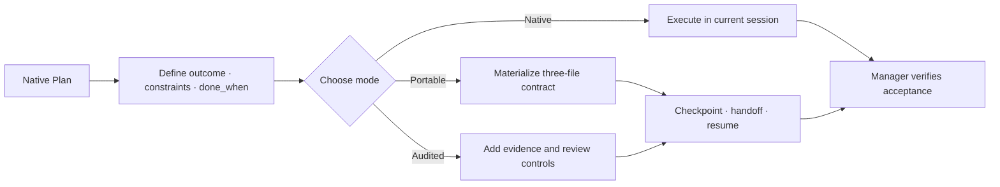

<div align="center">

# Agent Reliability Harness

**Runtime-neutral continuity and acceptance controls for AI coding agents.**

[简体中文](README.zh-CN.md) · English

[](https://github.com/SUNRNEHUI/agent-reliability-harness/releases) [](https://github.com/SUNRNEHUI/agent-reliability-harness/actions/workflows/ci.yml) [](https://www.python.org/downloads/) [](#license)

</div>

Current version: **v9.3.0** · 2026-08-27

Agent Reliability Harness is a Plan-native skill for reliable execution across Codex,
Claude Code, Grok, and other file-and-shell capable agents. It uses the runtime's own Plan
for ordinary work, materializes a compact provider-neutral contract only when work must
survive a boundary, and adds audit controls only when risk requires them.

**Choose the lightest mode that fits**

| Need | Mode | Durable state |
| --- | --- | --- |
| Finish and verify in the current session | **Native** | None; use the runtime Plan |
| Survive a session/model boundary or external wait | **Portable** | `contract.json`, `events.jsonl`, `capsule.md` |
| Prove high-risk, release, security, or production work | **Audited** | Portable state plus justified evidence and review controls |

**Quick start**

```bash
npx skills add https://github.com/SUNRNEHUI/agent-reliability-harness --skill "agent-reliability-harness"
```

[Overview](#overview) · [Execution modes](#execution-modes) · [Installation](#installation) · [Documentation map](#runtime-adapters) · [Release history](#release-history)

> **v9.3.0 highlights:** public Draft 2020-12 schemas, the `arh-status-v1` JSON projection,
> the restored confidence gate, a frozen 19-command controller surface, and Python 3.14 /
> Windows CI coverage with pinned Actions.

---

## Overview

Modern agents already plan, track tasks, use tools, and manage workers. Repeating those
capabilities in a second prompt-level state machine wastes context and creates competing
sources of truth. This skill adds only what a runtime cannot reliably carry across a
session or model boundary.

The manager remains responsible for:

- selecting Native, Portable, or Audited mode
- defining the outcome, constraints, approval boundaries, and observable `done_when`
- materializing only facts that are expensive or unsafe to reconstruct
- choosing a proportional implementation route: parent-direct for a v3 micro change only after
  explicit scope/risk/context/verification/cost confirmations, one bounded worker for ordinary or
  heavy work, and parallel workers only when complex module ownership is disjoint
- stopping reasoning loops that produce no observable progress
- verifying acceptance evidence before claiming completion

Sub-agents are used only for bounded execution, investigation, review, or evaluation tasks. They do not replace the manager's responsibility for final acceptance.

---

## Core Capabilities

- **Plan-native routing:** reuse the runtime Plan instead of generating a second checklist.
- **Portable Contract v2:** preserve only objective, decisions, milestones, blockers, next
  action, workspace fingerprint, evidence digests, capabilities, and tiered reads.
- **Bounded resume context:** regenerate `capsule.md` under a deterministic character budget.
- **Fail-closed continuation:** detect corruption, drift, stale ownership, multiple active
  runs, and Portable/legacy ambiguity before mutation.
- **Audited extensions:** retain typed receipts, Production State Witness, protected TDD
  chronology, evaluator separation, and stronger fencing for high-risk work.
- **Legacy compatibility:** continue to validate and resume `handoff-v1` Full artifacts.
- **Adapter-local routing:** keep provider and model slugs outside the portable core; use a
  configured `luna_worker` only for bounded execution that benefits from dispatch.
- **Progress Circuit Breaker:** require new evidence, an artifact change, a test result, or a
  binding decision that advances a named acceptance boundary; stop after two no-progress
  cycles without a new diagnosis.
- **Composable engineering workflow:** reuse active repository instructions or an available
  matching coding skill for implementation and verification; do not copy or require a named
  companion skill.
- **Complexity-proportional execution:** a v3 micro implementation can stay parent-direct only
  after explicit, auditable confirmations; ordinary or execution-heavy implementation uses one
  bounded worker; complex work uses parallel workers only at independent module boundaries, while
  tightly coupled writes stay serial or under one owner.
- **Lean packaging:** exclude duplicate prompts, repository tests/evals, generated
  `.harness/` and `workspace/` artifacts, caches, sessions, and private configuration.

---

## Execution Modes

| Mode | Use When | Durable State |
| --- | --- | --- |
| **Native** | The active session can finish and verify without costly reconstruction. | None; use the runtime Plan and task tracking. |
| **Portable** | Work may cross sessions/models, wait externally, or use workers whose results must survive context loss. | `.harness/<slug>/contract.json`, `events.jsonl`, `capsule.md` |
| **Audited** | Production, release, permissions, security, destructive changes, disputed ownership, or high fake-success risk needs stronger proof. | Portable state plus justified evidence and review extensions; legacy Full remains supported. |

Delegation is independent of mode. Native, Portable, and Audited choose persistence and
evidence depth; they do not turn a micro implementation into a larger workflow. A v3 micro,
local, low-risk, context-complete implementation that one short verification cycle can prove and
costs more to delegate may stay parent-direct only with explicit confirmations for those facts and
no protected boundary. The confirmations are routing assertions, not automatic proof; the parent
must verify them. Ordinary or execution-heavy implementation uses one bounded worker. Complex
work uses multiple agents only at independent module or ownership boundaries whose benefit exceeds
coordination cost; tightly coupled writes remain serial or have one owner. Explicit user
delegation overrides the micro direct choice.

---

## When To Use

Use this skill when the request involves:

- saying "You are the main agent" or "write a harness" to activate one mode gate
- writing a harness to solve this problem
- durable handoff or cross-model continuation
- resumable execution or a long external wait
- multi-agent, sub-agent, parallel, DAG, or worktree coordination
- 分头处理 / 分别派 / 拆给不同 agent
- evidence-based acceptance or a high fake-success risk

The trigger selects the skill, not the heaviest mode. Ordinary implementation can remain
Native when the repository workflow is sufficient. A qualifying v3 micro implementation may run
directly in the parent only after its six confirmations; ordinary/heavy implementation uses one
bounded worker when dispatch is available, and complex implementation is parallel only across
independent ownership boundaries.
Planning, review, and non-implementation work may stay in the parent thread when coordination
costs more than execution. Mechanical batch work is a separate bounded route, not a synonym for
micro implementation.

---

## Operating Flow



The manager should choose the lightest mode that preserves safe execution and honest
completion. Do not mirror a native Plan into JSON or Markdown.

Use `define-goal` or an available durable goal tool only when the user requests goal-backed
execution or the stopping condition is not measurable yet. Goal definition does not itself
authorize Portable state, Audited controls, or a worker.

## Progress And Codex Routing

Progress means new evidence, an artifact change, a test result, or a binding decision that
advances a named `done_when` criterion or critical-path blocker. Generated reports, package
rebuilds, inventory, and auxiliary checks do not count unless that criterion requires them.
After two no-progress cycles, run one falsifying experiment; if it yields no evidence, stop
that reasoning chain.

When explicit Codex routing is available, the parent/main Agent uses Sol `high` for the goal,
short plan, dispatch, status, integration, acceptance, and confirmed v3 micro implementations. A
locally installed `luna_worker` may run Luna `max` for ordinary or execution-heavy implementation.
Explicit user delegation selects that worker even for a micro-looking change. Simple mechanical
batch work remains a separate bounded route. Complex work is parallel only across independent
modules, and tightly coupled writes remain serial or have one owner. Custom-agent calls use a
self-contained `fork_turns=none` task; workers are leaves and do not recursively delegate.
Saying "main agent" does not prove a worker or model ran. If Luna or a requested implementation
model is unavailable or cannot be resolved, try another verifiable bounded worker; if none is
available, block implementation unless the user explicitly authorizes parent direct fallback.
Keep requested versus resolved models separate. Review starts only after a concrete candidate
exists, and retry requires a new diagnosis or evidence.

---

## Portable And Audited Protocol

Portable v2 is the default durable protocol. Audited controls are extensions, not a second
mandatory workflow.

### 1. Materialize A Contract

Materialize only after the native Plan is actionable and a durability trigger exists:

```bash
python3 <skill-dir>/scripts/harnessctl.py materialize . \
  --title "Checkout refactor" \
  --goal "Complete the checkout refactor without changing public behavior" \
  --done-when "Focused and regression tests pass" \
  --constraint "Preserve unrelated changes" \
  --next-action "Inspect the checkout state boundary"
```

This creates exactly three core files under `.harness/<slug>/`:

- `contract.json`: the only mutable source of truth
- `events.jsonl`: append-only transition and evidence index
- `capsule.md`: bounded, regenerated context for the receiving model

### 2. Checkpoint Verified Boundaries

Checkpoint after a meaningful verified result or before a likely interruption, not after
every tool call. Evidence remains in the project; the contract stores only a relative path,
SHA-256 digest, and size.

```bash
python3 <skill-dir>/scripts/harnessctl.py checkpoint . \
  --runtime codex --actor-id codex-main --owner-epoch 1 \
  --completed "Focused regression passes" \
  --next-action "Run the package verification" \
  --evidence-file reports/focused-test.txt \
  --reason "Verified implementation boundary"
```

The first checkpoint claims epoch 1 and omits `--owner-epoch`.

### 3. Handoff And Resume

Use `handoff` for a clean transfer. The replacement runtime starts from the project root:

```bash
python3 <skill-dir>/scripts/harnessctl.py resume . \
  --runtime claude --actor-id claude-main
```

`resume` validates the contract, rejects ambiguous active Portable/Full state, checks
workspace drift, transfers ownership, regenerates the capsule, and returns `must_read`,
`read_if_needed`, blockers, pending verification, and one safe next action. An abrupt active
owner takeover additionally requires `--takeover-reason`.

At a terminal boundary, run `close --status accepted|failed|cancelled`. Accepted closure
requires evidence and no unresolved blocker or pending verification; closed contracts no
longer participate in active-run selection.

### 4. Portable Data Boundary

Persist observable facts only: goal, `done_when`, constraints, completed milestones,
blockers, decisions with short rationale, changed paths, evidence digests, capabilities,
and tiered reads. Do not persist hidden reasoning, full chats, provider session objects,
secrets, or in-flight external side effects.

### 5. Audited Escalation

Add only the control required by the risk:

- typed acceptance receipts and manager re-verification
- Production State Witness for UI/state/async/concurrency paths
- protected RED/GREEN chronology for behavior changes
- evaluator separation, stronger rollback, and detailed trace
- owner epoch fencing for disputed or concurrent writers

Audited does not imply parallel workers. Worker use remains an independent cost/ownership
decision.

### 6. Legacy Full Compatibility

Existing `handoff-v1` artifacts under `workspace/<slug>/` remain valid. The same
`checkpoint`, `handoff`, `resume`, and `validate` commands continue to support them. Do not
rewrite a valid legacy artifact only to change its format.

### 7. Acceptance Boundary

Worker self-report and harness scores are not completion evidence. The manager must re-run
or inspect critical checks. For user-visible failures, policy-only unit tests cannot replace
flow or visible evidence when those tiers are available.

---

## Installation

Install from the repository with the generic Agent Skills installer:

```bash
npx skills add https://github.com/SUNRNEHUI/agent-reliability-harness
npx skills add https://github.com/SUNRNEHUI/agent-reliability-harness --skill "agent-reliability-harness"
```

The installer discovers the canonical package under `skills/`. To install from a local
checkout instead:

```bash
git clone https://github.com/SUNRNEHUI/agent-reliability-harness.git
cd agent-reliability-harness
npx skills add . --skill "agent-reliability-harness"
```

For a manual or development installation, verify and copy the same canonical package:

```bash
python3 scripts/sync_version.py
python3 scripts/package_skill.py --verify-source
python3 scripts/package_skill.py --output /tmp/agent-reliability-harness-runtime --force
```

Install the runtime package into Codex:

```bash
mkdir -p ~/.codex/skills/agent-reliability-harness
rsync -a --delete --exclude workspace --exclude .harness \
  /tmp/agent-reliability-harness-runtime/ ~/.codex/skills/agent-reliability-harness/
python3 scripts/package_skill.py --check ~/.codex/skills/agent-reliability-harness
```

The copy is byte-for-byte derived from `skills/agent-reliability-harness/`; there is no
second runtime file list to maintain.

Recommended Codex defaults for this routing policy:

```toml
model = "gpt-5.6-sol"
model_reasoning_effort = "high"
service_tier = "fast"

[agents]
default_subagent_model = "gpt-5.6-luna"
default_subagent_reasoning_effort = "max"
```

This configuration is optional and remains user-owned. Do not copy a private model cache
or set `model_catalog_json` as part of skill installation. If Luna is unavailable, retain the
requested route in evidence and try another verifiable bounded worker. If no worker can be
verified, block implementation; parent direct execution requires explicit user authorization.
Record the runtime-resolved route separately and do not claim that a Luna worker ran.

An optional named worker can make the bounded execution route explicit:

```toml
# ~/.codex/agents/luna-worker.toml
name = "luna_worker"
description = "Handle clearly bounded tasks"
model = "gpt-5.6-luna"
model_reasoning_effort = "max"
developer_instructions = "Execute only the delegated scope, return concise evidence, and do not expand scope."
```

The skill never creates this personal file. When it is installed and recognized by Codex,
the adapter uses `fork_turns=none` and sends a self-contained contract. Otherwise it tries
another verifiable bounded worker; if none is available, implementation is blocked rather than
silently executed by the parent.

---

## Migration From Earlier Names

Earlier releases used Agent Dispatch Harness as the public project and runtime name; older releases used `multi-agent-dispatcher` and some local installs used `multi-agent-orchestrator`. New installs should use `agent-reliability-harness`.

When upgrading an existing local install, install the new runtime directory first, then remove old local runtime folders if they are still present and no longer needed:

```bash
rm -rf ~/.codex/skills/agent-dispatch-harness ~/.codex/skills/multi-agent-dispatcher ~/.codex/skills/multi-agent-orchestrator
```

This avoids duplicate skill entries that describe the same workflow.

---

## Runtime Package Contents

`skills/agent-reliability-harness/` is the complete distributable package. It includes:

- `VERSION`
- `SKILL.md`
- `agents/openai.yaml`
- `adapters/`
- the references directly loaded by `SKILL.md` or the Audited protocol
- the controller, validator, status, model-routing, TDD, and State Witness scripts
- only templates copied by runtime commands or required by worker contracts

The directory itself is authoritative. `scripts/package_skill.py` validates and copies it;
it does not maintain a second allowlist.

It intentionally excludes:

- `README.md`
- `README.zh-CN.md`
- `scripts/sync_version.py`
- `scripts/package_skill.py`
- duplicate `master-prompt.md` and `sub-prompt.md`
- repository regression tests, protocol eval cases, and skill self-scoring tools
- source-only references and templates with no runtime consumer
- `.git`
- generated `.harness/` artifacts
- generated workspace artifacts
- local memory files
- session logs
- caches and bytecode
- private configuration
- credentials or API keys

---

## Usage Examples

Explicit multi-agent request:

```text
This project has frontend, backend, and test work. Use multiple agents where useful, and provide verification evidence.
```

Small task with multi-agent wording:

```text
Use multi-agent if needed to fix this typo.
```

Expected behavior: this is a non-implementation typo, so stay Native and do not delegate;
implementation requests use one bounded worker by default.

Long task requiring durable coordination:

```text
Refactor checkout, update API contracts, migrate tests, and verify the UI flow. Use sub-agents and keep the work resumable.
```

Expected behavior: materialize Portable state because the work must resume; add Audited
extensions only if the actual risk requires them. The parent keeps integration and acceptance;
implementation work uses bounded workers, parallel only where module ownership is independent.

---

## Portable Materialization And Audited Initialization

For new resumable work, materialize Portable v2:

```bash
python3 <skill-dir>/scripts/harnessctl.py materialize /path/to/project \
  --title "Checkout Refactor" \
  --goal "Refactor checkout while preserving behavior" \
  --done-when "Checkout regression suite passes" \
  --next-action "Inspect the production checkout flow"
```

This creates only:

```text
/path/to/project/.harness/checkout-refactor/
├── contract.json
├── events.jsonl
└── capsule.md
```

For a new Audited run, initialize the protected record set:

```bash
python3 <skill-dir>/scripts/init_run.py \
  --project-root /path/to/project \
  --mode audited \
  --title "Checkout Refactor" \
  --agents frontend,backend,tests
```

This creates:

```text
/path/to/project/workspace/checkout-refactor/
├── acceptance_registry.json
├── capability_snapshot.md
├── task_spec.md
├── progress.md
├── run_state.json
├── trace.jsonl
├── tdd_trace.jsonl
├── evaluator_report.md
└── tasks/
    ├── 1.1-frontend.md
    ├── 1.2-backend.md
    └── 1.3-tests.md
```

The generated `run_state.json` records `mode: audited`. Existing `mode: full`
`handoff-v1` artifacts remain readable and resumable, but new examples and defaults do not
create that legacy mode.

---

## Report Validation

Validate a Portable contract directly:

```bash
python3 <skill-dir>/scripts/harnessctl.py validate /path/to/project/.harness/checkout-refactor
```

For Audited or legacy artifacts, validate generated reports before relying on them:

```bash
python3 <skill-dir>/scripts/validate_report.py <artifact-dir>/1.1-frontend-report.md --type subagent
```

Supported artifact types:

- `spec`
- `progress`
- `subagent`
- `evaluator`

When protocol files such as `acceptance_registry.json` or `run_state.json` sit next to a validated artifact, the validator also checks those files.

For TDD-sensitive work, validate the dedicated TDD trace:

```bash
python3 <skill-dir>/scripts/tdd_gate_check.py <artifact-dir>/tdd_trace.jsonl
```

The checker validates chronology for strict TDD, accepts test-first gap evidence when recorded, and rejects missing substitute reasons.

Use the test wrapper when available so trace events are generated by the runtime command runner rather than hand-written by an agent:

```bash
python3 <skill-dir>/scripts/harness_test_run.py \
  --trace <artifact-dir>/tdd_trace.jsonl \
  --task-id 1.1 \
  --gate-mode strict_tdd \
  --phase RED \
  --run-state <artifact-dir>/run_state.json \
  -- pytest path/to/test.py
```

For strict TDD cycles, `tdd_gate_check.py --source-path <file>` can add filesystem mtime checks for the files changed in that cycle.

For CI or release gates, require the run to reach high completion confidence:

```bash
python3 <skill-dir>/scripts/status.py <artifact-dir>/run_state.json --require-high-confidence
```

For automation, emit the versioned `arh-status-v1` JSON projection. It remains valid JSON
when combined with the strict gate and the command exits `1`:

```bash
python3 <skill-dir>/scripts/status.py <artifact-dir>/run_state.json --json
```

The runtime package also publishes Draft 2020-12 schemas for Portable contracts, Audited run
state, acceptance registries, worker results, and status output. See
[`references/public-contracts.md`](skills/agent-reliability-harness/references/public-contracts.md)
for the structural-versus-semantic validation boundary.

---

## Development

The runtime and repository checks use the Python standard library:

```bash
python3 -m unittest discover -s tests -v
python3 tests/test_runtime_behavior.py
python3 tests/protocol_regression_harness.py \
  --skill-root skills/agent-reliability-harness --pretty
python3 tests/evals/score_forward.py \
  --cases tests/evals/forward_cases.json --results /path/to/agent-results.json
python3 scripts/schema_smoke.py
python3 scripts/package_skill.py --verify-source
npx --yes skills@1.5.23 add . --list
git diff --check
```

The unit suite covers the open package contract as well as runtime behavior. The final
`npx` check proves that a generic cross-agent installer discovers exactly the canonical
Skill under `skills/`.

---

## Repository Layout

```text
agent-reliability-harness/
├── skills/
│   └── agent-reliability-harness/   # complete installable Skill package
│       ├── SKILL.md
│       ├── VERSION
│       ├── adapters/
│       ├── agents/
│       ├── references/
│       ├── schemas/
│       ├── scripts/
│       └── templates/
├── tests/                           # repository regression tests and fixtures
├── scripts/                         # repository packaging/version tools
├── docs/                            # non-runtime design and legacy material
├── README.md
└── README.zh-CN.md
```

The `skills/` directory is the distribution boundary. Repository tests and historical
materials remain outside it so compatible installers cannot accidentally package them.

---

## Runtime Adapters

The protocol is runtime-neutral. Use this map to jump to the entry point that matches your
runtime or integration boundary:

| Area | Documentation |
| --- | --- |
| Runtime adapters | [Codex](skills/agent-reliability-harness/adapters/codex.md) · [Grok](skills/agent-reliability-harness/adapters/grok.md) · [Claude Code](skills/agent-reliability-harness/adapters/claude-code.md) |
| Durable protocol | [Portable Contract v2](skills/agent-reliability-harness/references/portable-contract.md) · [Audited and legacy protocol](skills/agent-reliability-harness/references/harness-protocol.md) |
| Public interfaces | [Public JSON and CLI contracts](skills/agent-reliability-harness/references/public-contracts.md) |

Adapters map native planning, worker controls, and optional model profiles to each runtime.
They must not add provider-specific fields to the Portable contract.

---

## Relationship To Superpowers

This project is independent and does not require Superpowers to run.

The design is influenced by [obra/superpowers](https://github.com/obra/superpowers), a software development methodology by Jesse Vincent. Agent Reliability Harness adopts compatible engineering patterns such as test-first evidence, fresh-context sub-agents, review gates, worktree isolation, and verification before completion.

The project does not copy Superpowers skill bodies and does not require the Superpowers plugin. The relationship is:

```text
agent-reliability-harness = durability and acceptance authority
Superpowers-style methods = optional supporting engineering practices
```

Native / Portable / Audited selection runs first. Supporting methods are applied only when
they fit the selected mode and measured risk.

---

## Release History

### v9.3.0

- Published Draft 2020-12 schemas for Portable v2, Audited run state, acceptance registry,
  worker result, and the new `arh-status-v1` machine projection while keeping semantic,
  cross-file, chronology, and filesystem checks in the standard-library runtime validators.
- Added `status.py --json` and restored the published `--require-high-confidence` exit gate;
  default human output and reporting exit behavior remain compatible.
- Froze the 19-command `harnessctl.py` surface and key exit behavior with repository-only
  contract tests before controller modularization.
- Added Python 3.14 and Windows CI lanes, pinned GitHub Actions to verified full commit SHAs,
  and added schema, package, and commit-diff smoke gates.

### v9.2.2

- Added a three-level implementation route: qualifying micro changes may stay parent-direct on
  Sol `high`, ordinary or execution-heavy changes use one bounded Luna `max` worker, and complex
  work is parallel only across independent module or ownership boundaries.
- Added the explicit, six-confirmation `--micro-implementation` selector and kept
  `--implementation` as the worker route; mechanical batch routing remains separate and
  ambiguous/protected or historical-policy combinations are rejected.
- Preserved `progress-bounded-v3` and sealed v1/v2 compatibility while retaining requested versus
  resolved model records, leaf workers, ownership boundaries, retry gates, and approval fallback.

### v9.2.1

- Made the current parent/worker route `progress-bounded-v3`, preserving the `progress-bounded-v2`
  Codex map for sealed historical runs instead of silently reinterpreting their dispatches.
- Made missing or unresolvable implementation workers fail closed: try another verifiable
  bounded worker, then block unless the user explicitly authorizes parent execution.
- Added explicit sealed-policy selection and rejected mixed implementation/diagnosis routes so
  Sol decision work cannot silently become implementation.

### v9.2.0

- Moved the complete installable Skill into the open
  `skills/agent-reliability-harness/` layout and made it the single runtime authority.
- Separated repository tests, maintenance tools, and legacy design material from the
  distributable package.
- Replaced the hand-maintained runtime allowlist with whole-package verification and copy.
- Added package-contract tests, cross-agent discovery validation, and multi-version CI.
- Added a portable workflow-composition contract so code tasks reuse local engineering
  rules without making any companion skill a dependency.
- Added complexity-proportional delegation: simple implementation uses one bounded worker;
  genuinely complex work is parallel only across independent module or ownership boundaries,
  with tightly coupled writes kept serial or under one owner.
- Added eight repository-only forward-routing cases and a structured scorer for independent
  Agent behavior checks without packaging eval assets into the runtime Skill.
- Kept Native a lightweight persistence/evidence path: it does not add references or artifacts
  solely because the skill triggered, while implementation delegation remains an independent
  execution-shape decision.
- Added conditional `luna_worker` routing for self-contained `fork_turns=none` execution;
  the parent still owns planning and final acceptance.
- Made new Audited artifacts record `mode: audited` while preserving legacy `mode: full`
  validation, discovery, TDD digest protection, handoff, and resume.
- Removed duplicate prompts, development tests/evals, self-scoring tools, and unused source
  templates from the runtime package without deleting repository regression assets.
- Tightened progress to the named acceptance boundary and added an explicit Portable
  checkpoint capsule budget.

### v9.1.0

- Established separate Codex parent planning/acceptance and Luna execution routes; v9.2 now
  makes the parent `Sol high` and child `Luna max` mapping explicit.
- Documented the optional Codex parent/sub-agent configuration and kept private model-cache
  overrides outside the distributed skill.
- Clarified that routed profiles do not replace the active parent session and that requested
  versus resolved models must be recorded separately.

### v9.0.0

- Added an observable Progress Circuit Breaker that stops after two no-progress cycles and
  requires a fresh diagnosis before rerouting.
- Routed long-running and mechanical Codex execution to Luna `max`; limited Sol to bounded
  diagnosis, planning, and concrete acceptance review.
- Versioned the new route as `progress-bounded-v2` while preserving sealed validation for
  legacy `cost-aware-v1` Audited runs.
- Removed domain-specific effect-reconstruction policy from the generic skill entry and
  reduced duplicate planning, reporting, and review instructions.

### v8.0.0

- Replaced the prompt-level Direct/Lite/Full router with Plan-native Native, Portable, and
  Audited modes.
- Added Portable Contract v2 with a three-file core, bounded resume capsule, tiered reads,
  evidence digests, workspace drift checks, cross-runtime owner transfer, and terminal close.
- Kept `handoff-v1` Full compatibility while moving provider/model maps outside the
  portable schema and retaining heavy evidence controls only for Audited work.

### v7.5.0

- Added typed evidence hardening, artifact binding, lessons integrity, protected TDD
  chronology, and adversarial protocol regression coverage for Full runs.

### v7.4.0

- Added unique-active-run discovery, transaction recovery, atomic cross-runtime ownership transfer, complete resume packets, explicit checkpoint/handoff commands, and legacy Full artifact upgrade.
- Added actor-plus-epoch fencing, fail-closed ambiguity/corruption handling, repository content drift detection, and continuation status output.
- Brought the existing v7.3 Grok model routing and evidence refresh commands back into source, then aligned Codex/Grok/universal adapters and package contents.

### v7.3.0

- Added sealed Grok model profiles, deterministic `--runtime grok` routing, a Grok adapter, and opt-in cheaper-model configuration without inventing unavailable defaults.
- Added `task-refresh` and `acceptance-refresh` for transactionally replacing stale artifact receipts by path.

### v7.2.0

- Added a Production State Witness contract for state/UI/async/concurrency work, including source locators, reachable truth-table rows, observed-before/expected-after values, and preserved blocking cases.
- Enforced the witness at runtime: invalid stateful artifacts cannot seal, dispatch, validate, or reach protected acceptance; independent review evidence must meet the configured policy/flow/user-visible tier.
- Added `witness-set`, sealed witness digests, sealed-baseline dispatch checks, adversarial pressure tests, and source/install package drift checks.

### v7.0.0

- Rebranded the project and runtime skill as Agent Reliability Harness.
- Reworked the public README and runtime metadata around policy-driven, proportional, evidence-based execution.

### v5.11.0

- Compared the harness with `Cjbuilds/Codex-Orchestration` and documented which thin-routing ideas are adopted and which high-overhead bridges and ceremony are explicitly excluded.
- Kept the active parent model as the only root orchestrator, made explicit `no subagents` instructions authoritative, and tightened truthful model-route states.
- Added `scripts/status.py --require-high-confidence` for CI or release gates while preserving the default compact human-readable status output.
- Reduced default alignment questioning to irreversible or acceptance-relevant decisions; ordinary ambiguity now uses a stated reversible assumption.

### v5.10.0

- Added GPT-5.6-aware Codex routing: Luna/low for simple sub-agents, Terra for moderate work, and Sol for critical review when explicit runtime controls are available.
- Added bounded worker budgets, shallow nesting, task-local context, compact reports, and model-override fallback rules.
- Made Superpowers-style methods risk-triggered and optional instead of a default ceremony bundle.
- Added model-routing guidance, regression cases, and runtime packaging coverage without adding GPT-5.6-specific API fields.

### v5.9.0

- Added a proportional Completion Confidence Loop to check final claims against fresh evidence before handoff.
- Expanded Verification and Evaluator guidance to expose missing checks, stale evidence, stubs, TODOs, mocks, and unverified critical paths.
- Enhanced `scripts/status.py` with task completion, acceptance rollup, evidence-gap detection, confidence bands, and next-verification guidance.
- Added lightweight confidence and evidence-gap prompts to the progress ledger and Lite plan templates.
- Preserved right-sized execution: Direct remains artifact-free, Lite remains compact, and Full remains the durable protocol for high-risk or resumable work.
- Added no new artifact type.

### v5.8.0

- Added `VERSION` plus `scripts/sync_version.py` so current-version references can be checked or updated from one source.
- Added runtime package checks with `scripts/package_skill.py --verify-source` and `--check <install-dir>`.
- Added Lite Orchestration artifacts through `templates/lite_plan.md`, `templates/lite_review.md`, and `init_run.py --mode lite`.
- Kept `progress.md` lightweight and added `scripts/status.py` for a generated single-screen summary from `run_state.json`.
- Added validator support for `lite_plan`, `lite_review`, and Lite `run_state.json`, plus runtime behavior tests.
- Kept automated mode-router evaluation out of this release; `references/eval_cases.md` remains the human-readable regression set.

### v5.7.0

- Added an explicit State and Memory boundary for Full Harness runs.
- Clarified that `task_spec.md` is the local human-readable plan/spec, while `run_state.json` is the machine-readable live state.
- Added `state_layers` for Working State, Session State, Execution Log, and Memory Boundary.
- Added `references/state-memory-boundary.md` and included it in runtime packaging.
- Updated validation to require the core `state_layers` structure in `run_state.json`.

### v5.6.0

- Renamed the public project and runtime skill from Multi-Agent Dispatcher to Agent Dispatch Harness.
- Updated repository URLs, install paths, runtime metadata, and bilingual documentation for the new name.
- Renamed the TDD command wrapper to `scripts/harness_test_run.py` and updated trace `source` values.
- Added migration guidance for older `multi-agent-dispatcher` and `multi-agent-orchestrator` local installs.
- Preserved the Direct, Lite, and Full mode model, with Full Harness remaining the durable advanced execution protocol.

### v5.5.0

- Added wrapper-generated TDD trace support for verification commands, now exposed as `scripts/harness_test_run.py`.
- Extended `scripts/tdd_gate_check.py` with optional `--source-path` mtime checks for strict TDD cycles.
- Added `tdd_current_cycle_context` to run-state templates and initialization output.
- Clarified that normal workers should prefer wrapper-generated trace evidence over hand-written TDD traces.
- Added retry, checkpoint, and rollback guidance to Bugfix and Feature-Spec lanes without allowing automatic `git reset --hard` in the main worktree.

### v5.4.0

- Added Bugfix Lane and Feature-Spec Lane references for task-type-specific development flow.
- Added `templates/tdd_trace.jsonl` and `scripts/tdd_gate_check.py` for runtime-neutral TDD chronology validation.
- Updated run initialization and runtime packaging so TDD trace artifacts and checker scripts are included.
- Tightened sub-agent and evaluator templates to require trace path, chronology summary, first production edit, and unverified critical path fields.
- Expanded evaluation cases for code-before-RED, passing-test-as-RED, shell-bypass, UI-only-unit-test, self-report-only, and missing no-test-reason failures.
- Added `.gitignore` protection for generated workspaces, worktrees, and Python cache files.

### v5.3.0

- Added a two-level testing model: `Test-First Evidence Gate` and `Strict TDD Gate`.
- Added `references/tdd-gates.md` for RED/GREEN, substitute verification, and manager acceptance rules.
- Added required `Test-First Or Substitute Verification` fields to sub-agent reports.
- Extended protocol JSON records with `verification_gate`.
- Updated validation so sub-agent reports and protocol records cannot omit the testing gate structure.

### v5.2.2

- Rewrote the English and Chinese README files in a formal public documentation style.
- Clarified the project positioning, execution modes, installation flow, runtime package boundary, and Superpowers acknowledgement.
- No runtime protocol changes.

### v5.2.1

- Added bilingual public documentation.
- Added an explicit acknowledgement of Superpowers-inspired engineering patterns.
- Added `scripts/package_skill.py` for clean runtime-only packaging.
- Consolidated Direct, Lite, and Full routing guidance in the public README.
- Expanded evaluation coverage for TDD evidence, review separation, Superpowers interaction, and clean sharing.

### v5.0.1

- Added a right-sizing gate before capability checks and DAG creation.
- Clarified that explicit multi-agent wording authorizes evaluation, not automatic dispatch.
- Added guidance to skip workers, worktrees, and artifacts for small tasks.

### v5.0.0

- Upgraded the project from protocol guidance into a manager-enforced harness protocol.
- Added capability snapshots, `run_state.json`, `acceptance_registry.json`, and `trace.jsonl`.
- Added evaluator validation and runtime adapters for Codex and Claude Code-style environments.

### v4.0.0

- Introduced the closed-loop multi-agent protocol.
- Added artifact initialization, report validation, role boundaries, stop conditions, and evaluator templates.

---

## License

No license file is currently included in this repository.
