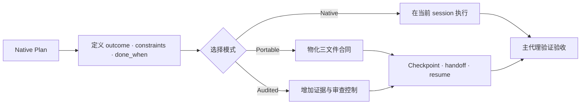

<div align="center">

# Agent Reliability Harness

**面向 AI 编程代理的运行时中立续接与验收控制。**

简体中文 · [English](README.md)

[](https://github.com/SUNRNEHUI/agent-reliability-harness/releases) [](https://github.com/SUNRNEHUI/agent-reliability-harness/actions/workflows/ci.yml) [](https://www.python.org/downloads/) [](#许可证)

</div>

当前版本：**v9.3.0** · 2026-08-27

Agent Reliability Harness 是一个面向 Codex、Claude Code、Grok 及其他具备文件与
shell 能力代理的 Plan-native 可靠性 skill。普通任务直接复用运行时原生 Plan；只有
任务必须跨越边界时才物化紧凑、provider-neutral 的合同；只有风险需要时才增加审计控制。

**选择合适的最轻模式**

| 需求 | 模式 | 持久状态 |
| --- | --- | --- |
| 在当前 session 内完成并验证 | **Native** | 无；使用运行时 Plan |
| 跨 session/model 或外部等待后继续 | **Portable** | `contract.json`、`events.jsonl`、`capsule.md` |
| 证明高风险、发布、安全或生产任务 | **Audited** | Portable 状态加必要的证据与审查控制 |

**快速开始**

```bash
npx skills add https://github.com/SUNRNEHUI/agent-reliability-harness --skill "agent-reliability-harness"
```

[概览](#概览) · [执行模式](#执行模式) · [安装](#安装) · [文档导航](#运行时适配)

> **v9.3.0 亮点：** 发布 Draft 2020-12 公共 Schema、`arh-status-v1` JSON 投影、恢复
> confidence gate，冻结 19 个 controller 命令，并增加 Python 3.14 / Windows CI 与固定
> SHA 的 Actions。

---

## 概览

现代 agent 已经具备规划、任务跟踪、工具调用和 worker 管理能力。再在 prompt 中实现
第二套状态机会浪费上下文，并制造相互竞争的真相源。本 skill 只补充运行时无法可靠
带过会话或模型边界的部分。

主代理始终负责：

- 选择 Native、Portable 或 Audited
- 定义结果、约束、授权边界和可观察的 `done_when`
- 只物化昂贵或不安全的重建信息
- 按比例选择实现路径：v3 微型改动必须先显式确认 scope/risk/context/verification/cost，
  才能由 parent 直接完成；普通/重实现使用一个有界 worker，复杂任务只有在责任边界独立
  时才并行
- 停止没有产生可观察进展的推理循环
- 在声明完成前验证验收证据

子代理只负责边界明确的执行、调研、审查或评估任务。最终验收责任仍由主代理承担。

---

## 核心能力

- **Plan-native 路由：** 复用运行时 Plan，不再生成第二份 checklist。
- **Portable Contract v2：** 只保存目标、决策、里程碑、阻塞、下一动作、workspace
  fingerprint、证据摘要、能力和分级读取路径。
- **有界 resume 上下文：** 在确定性的字符预算内重新生成 `capsule.md`。
- **Fail-closed 续接：** 写入前检测损坏、drift、过期 owner、多个 active run 和跨协议歧义。
- **Audited 扩展：** 高风险任务保留 typed receipts、Production State Witness、受保护
  TDD chronology、evaluator separation 和更强 fencing。
- **旧格式兼容：** 继续校验和恢复 `handoff-v1` Full artifact。
- **Adapter-local 路由：** provider 和 model slug 不进入 Portable 核心；只有派发收益
  明确时才使用已配置的 `luna_worker` 执行有界任务。
- **进度熔断：** 每轮必须产生推进明确验收边界的新证据、artifact 变更、测试结果或
  约束性决策；连续两轮无进展且没有新诊断时停止。
- **可组合工程工作流：** 代码实现与验证复用当前仓库规则或可用的匹配 coding skill；
  不复制，也不强制依赖某个具名 companion skill。
- **按复杂度委派：** v3 微型、局部、低风险且上下文完整的实现，只有显式确认六项 gate
  后才可由 parent 直接完成；普通或执行较重的实现只派一个有界 worker；复杂任务只在
  独立模块边界并行，强耦合写入保持串行或由单一 owner 负责。
- **精简打包：** 排除重复 prompt、仓库测试/eval、生成的 `.harness/` / `workspace/`
  artifact、缓存、session 和私有配置。

---

## 执行模式

| 模式 | 适用场景 | 持久状态 |
| --- | --- | --- |
| **Native** | 当前 session 可以完成并验证，丢失上下文不会造成昂贵重建。 | 无；使用运行时 Plan 和任务跟踪。 |
| **Portable** | 工作可能跨 session/model、等待外部状态，或 worker 结果必须跨 context loss 保留。 | `.harness/<slug>/contract.json`、`events.jsonl`、`capsule.md` |
| **Audited** | 生产、发布、权限、安全、破坏性变更、owner 争议或高假完成风险需要更强证据。 | Portable 状态加按风险启用的证据与审查扩展；兼容 legacy Full。 |

委派与模式相互独立。Native、Portable、Audited 只决定持久化和证据深度，不会把微型
实现变成更重的流程。v3 微型、局部、低风险、上下文明确、一个短验证周期即可证明且
委派成本更高的实现，必须显式确认 scope-local、low-risk/no-protected-boundary、
context-complete、short-verification、delegation-cost-higher 后，才可由 parent 直接完成。
这些确认是可审计的路由断言，不是自动事实证明；parent 仍负责验证真实性。普通或执行较重
的实现只派一个有界 worker。复杂任务只有在存在独立模块或责任边界且收益高于协调成本时
才并行；强耦合写入保持串行或由单一 owner 负责。用户显式要求委派时，覆盖微型实现的
direct 选择。

---

## 适用场景

当请求涉及以下能力时使用本 skill：

- 输入“你是主 agent”或“写一个 harness”以启动一次模式判断
- “写一个 harness 来解决这个问题”
- 持久 handoff 或跨模型续接
- 可续跑执行或长时间外部等待
- 多智能体、sub-agent、并行、DAG 或 worktree 协同
- 分头处理 / 分别派 / 拆给不同 agent
- 证据化验收或高假完成风险

触发 skill 不等于选择最重模式。普通实现可以保持 Native；符合条件的微型实现可以由
parent 直接完成，普通/重实现则在运行时可派发时使用一个有界 worker，复杂实现只在独立
责任边界并行。规划、审查和非实现工作在协调成本更高时可以留在父 Agent 线程。机械批量
是独立的有界路径，不等同于微型实现。

---

## 运行流程



主代理应选择能够保证安全执行和真实完成的最轻模式。不要把原生 Plan 再复制到 JSON
或 Markdown。

只有用户要求持久目标，或停止条件还无法度量时，才使用 `define-goal` 或可用的持久目标
工具。定义 goal 本身不会授权 Portable 状态、Audited 控制或 worker。

## 进度与 Codex 路由

进展只包括能推进明确 `done_when` 或关键路径 blocker 的新证据、artifact 变更、测试
结果或约束性决策。生成报告、重建 package、扩大清单和辅助检查不推进该验收边界时不算
进展。连续两轮无进展后只运行一个证伪实验；仍没有新证据就停止该推理链。

当 Codex 支持显式路由时，父/主 Agent 使用 Sol `high` 持有目标、短计划、分发、状态、
整合、验收，以及完成六项确认的 v3 微型实现。本机已安装的 `luna_worker` 使用 Luna `max` 执行
普通或执行较重的实现。用户显式要求委派时，即使改动看起来很小，也选择该 worker。机械
批量保持独立的有界路径；复杂任务只在独立模块间并行，强耦合写入保持串行或由单一 owner
负责。自定义 Agent 调用使用自包含的 `fork_turns=none` 任务；子 Agent 是叶节点，不递归委派。
说“你是主 agent”不能证明 worker 或 model 已运行。如果 Luna 或 requested implementation
model 不可用、无法解析，先尝试另一个可验证的 bounded worker；仍没有就阻塞实现，除非用户
明确授权 parent 直接作为 fallback。分别记录 requested model 和 resolved model，不能虚假声称。
只有具体候选结果出现后才审查，只有新诊断或新证据出现后才重试。

---

## Portable 与 Audited 协议

Portable v2 是默认持久协议。Audited 控制是扩展，不是每次都必须执行的第二套工作流。

### 1. 物化合同

只有原生 Plan 已经可执行且存在持久化触发条件时，才物化合同：

```bash
python3 <skill-dir>/scripts/harnessctl.py materialize . \
  --title "Checkout refactor" \
  --goal "完成 checkout 重构且不改变公开行为" \
  --done-when "focused 与 regression 测试通过" \
  --constraint "保留无关改动" \
  --next-action "检查 checkout 状态边界"
```

命令只在 `.harness/<slug>/` 下创建三个核心文件：

- `contract.json`：唯一可变真相
- `events.jsonl`：append-only transition 与 evidence 索引
- `capsule.md`：为接收模型重新生成的有界上下文

### 2. 在已验证边界 Checkpoint

只在有意义的验证结果之后或可能中断之前 checkpoint，不要每次 tool call 后都写入。
证据留在项目中；合同只保存相对路径、SHA-256 和文件大小。

```bash
python3 <skill-dir>/scripts/harnessctl.py checkpoint . \
  --runtime codex --actor-id codex-main --owner-epoch 1 \
  --completed "Focused regression passes" \
  --next-action "Run the package verification" \
  --evidence-file reports/focused-test.txt \
  --reason "Verified implementation boundary"
```

第一次 checkpoint 会领取 epoch 1，因此省略 `--owner-epoch`。

### 3. Handoff 与 Resume

正常交接使用 `handoff`。替代运行时从项目根开始：

```bash
python3 <skill-dir>/scripts/harnessctl.py resume . \
  --runtime claude --actor-id claude-main
```

`resume` 会校验合同、拒绝同时 active 的 Portable/Full 歧义、检查 workspace drift、转移
owner、重建 capsule，并返回 `must_read`、`read_if_needed`、blockers、pending
verification 和一个安全 next action。强制接管 active owner 时还必须提供
`--takeover-reason`。

到达终态时运行 `close --status accepted|failed|cancelled`。`accepted` 要求已有证据且
没有 unresolved blocker 或 pending verification；关闭后的合同不再参与 active run 选择。

### 4. Portable 数据边界

只持久化可观察事实：目标、`done_when`、约束、已完成里程碑、阻塞、带简短理由的决策、
changed paths、证据摘要、能力和分级读取路径。不要持久化隐藏 reasoning、完整聊天、
provider session object、secret 或 in-flight 外部副作用。

### 5. Audited 升级

只增加风险真正需要的控制：

- typed acceptance receipts 与 manager re-verification
- UI/state/async/concurrency 路径的 Production State Witness
- 行为变更的受保护 RED/GREEN chronology
- evaluator separation、更强 rollback 和详细 trace
- owner 争议或并发 writer 的 epoch fencing

Audited 不等于必须并行。worker 仍是独立的成本与责任边界决策。

### 6. Legacy Full 兼容

`workspace/<slug>/` 下的既有 `handoff-v1` artifact 继续有效。同一组 `checkpoint`、
`handoff`、`resume` 和 `validate` 命令仍支持它们。不要仅为换格式重写有效旧 artifact。

### 7. 验收边界

worker self-report 和 harness score 都不是完成证据。manager 必须重新运行或检查关键
验证。对用户可见故障，在 flow 或 visible evidence 可用时，policy-only unit test 不能
替代它们。

---

## 安装

使用通用 Agent Skills 安装器从仓库安装：

```bash
npx skills add https://github.com/SUNRNEHUI/agent-reliability-harness
npx skills add https://github.com/SUNRNEHUI/agent-reliability-harness --skill "agent-reliability-harness"
```

安装器会发现 `skills/` 下的权威包。需要从本地 checkout 安装时：

```bash
git clone https://github.com/SUNRNEHUI/agent-reliability-harness.git
cd agent-reliability-harness
npx skills add . --skill "agent-reliability-harness"
```

手动安装或开发验证时，校验并复制同一个权威包：

```bash
python3 scripts/sync_version.py
python3 scripts/package_skill.py --verify-source
python3 scripts/package_skill.py --output /tmp/agent-reliability-harness-runtime --force
```

安装到 Codex：

```bash
mkdir -p ~/.codex/skills/agent-reliability-harness
rsync -a --delete --exclude workspace --exclude .harness \
  /tmp/agent-reliability-harness-runtime/ ~/.codex/skills/agent-reliability-harness/
python3 scripts/package_skill.py --check ~/.codex/skills/agent-reliability-harness
```

复制结果逐文件来自 `skills/agent-reliability-harness/`，不再维护第二份 runtime 文件清单。

这套路由策略推荐使用以下 Codex 默认配置：

```toml
model = "gpt-5.6-sol"
model_reasoning_effort = "high"
service_tier = "fast"

[agents]
default_subagent_model = "gpt-5.6-luna"
default_subagent_reasoning_effort = "max"
```

这段配置是可选的，始终由用户自行维护。Skill 安装过程不复制私有 model cache，也不
设置 `model_catalog_json`。如果 Luna 不可用，应保留 requested route，并尝试另一个可验证的
bounded worker；没有可验证 worker 就阻塞实现，只有用户明确授权时 parent 才能直接执行。
单独记录运行时实际解析的 route；不能声称 Luna worker 已经运行。

可选的命名 worker 可以把有界执行通道显式化：

```toml
# ~/.codex/agents/luna-worker.toml
name = "luna_worker"
description = "处理边界清晰任务"
model = "gpt-5.6-luna"
model_reasoning_effort = "max"
developer_instructions = "只执行明确委派任务，返回简洁证据结果，不扩大范围。"
```

Skill 不会创建这个个人配置文件。Codex 已安装并识别它时，adapter 使用
`fork_turns=none` 并发送自包含任务；缺少它时尝试另一个可验证的 bounded worker；仍没有
就阻塞实现，不得静默由 parent 执行。

---

## 从旧名称迁移

早期版本曾使用 Agent Dispatch Harness 作为公开项目和 runtime 名称，更早版本使用 `multi-agent-dispatcher`，一些本地安装也使用过 `multi-agent-orchestrator`。新的安装和公开传播应统一使用 `agent-reliability-harness`。

升级已有本地安装时，先安装新的 runtime 目录；如果旧目录仍存在且不再需要，可以删除：

```bash
rm -rf ~/.codex/skills/agent-dispatch-harness ~/.codex/skills/multi-agent-dispatcher ~/.codex/skills/multi-agent-orchestrator
```

这样可以避免同一套工作流以多个 skill 名称重复出现。

---

## Runtime 包内容

`skills/agent-reliability-harness/` 是完整的可分发包，其中包含：

- `VERSION`
- `SKILL.md`
- `agents/openai.yaml`
- `adapters/`
- `SKILL.md` 或 Audited 协议直接加载的 references
- controller、validator、status、模型路由、TDD 和 State Witness scripts
- 只有 runtime 命令实际复制或 worker contract 需要的 templates

该目录本身就是权威边界。`scripts/package_skill.py` 只负责校验和复制，不再维护第二份白名单。

runtime 包会排除：

- `README.md`
- `README.zh-CN.md`
- `scripts/sync_version.py`
- `scripts/package_skill.py`
- 重复的 `master-prompt.md` 和 `sub-prompt.md`
- 仓库回归测试、协议 eval case 和 skill 自评分工具
- 没有 runtime consumer 的 source-only references 与 templates
- `.git`
- 生成的 `.harness/` artifact
- 生成的 workspace artifact
- 本地 memory 文件
- session 日志
- 缓存和字节码
- 私有配置
- 凭据或 API key

---

## 使用示例

明确的多智能体请求：

```text
这个项目有前端、后端和测试三块。请在有价值的地方使用多个 agent，并提供验证证据。
```

带有多智能体措辞的小任务：

```text
如果需要可以用多智能体，帮我修正这个错别字。
```

预期行为：这是非实现类错别字修改，保持 Native，不进行调度；实现请求默认只派一个有界
worker。

需要持久化协同的长任务：

```text
重构 checkout，更新 API contract，迁移测试，并验证 UI 流程。请使用子 agent，并让任务可以续跑。
```

预期行为：因为任务必须续跑，所以物化 Portable 状态；只有实际风险需要时才增加
Audited 扩展。父 Agent 负责整合和验收；实现工作使用有界 worker，只在模块责任独立时并行。

---

## Portable 物化与 Audited 初始化

新的可续跑任务使用 Portable v2：

```bash
python3 <skill-dir>/scripts/harnessctl.py materialize /path/to/project \
  --title "Checkout Refactor" \
  --goal "重构 checkout 并保留现有行为" \
  --done-when "Checkout regression suite passes" \
  --next-action "Inspect the production checkout flow"
```

只生成：

```text
/path/to/project/.harness/checkout-refactor/
├── contract.json
├── events.jsonl
└── capsule.md
```

新建 Audited run 时，初始化受保护记录：

```bash
python3 <skill-dir>/scripts/init_run.py \
  --project-root /path/to/project \
  --mode audited \
  --title "Checkout Refactor" \
  --agents frontend,backend,tests
```

生成目录示例：

```text
/path/to/project/workspace/checkout-refactor/
├── acceptance_registry.json
├── capability_snapshot.md
├── task_spec.md
├── progress.md
├── run_state.json
├── trace.jsonl
├── tdd_trace.jsonl
├── evaluator_report.md
└── tasks/
    ├── 1.1-frontend.md
    ├── 1.2-backend.md
    └── 1.3-tests.md
```

生成的 `run_state.json` 写入 `mode: audited`。既有 `mode: full` `handoff-v1`
artifact 仍可读取和恢复，但新示例与默认值不再创建该 legacy mode。

---

## 报告校验

直接校验 Portable contract：

```bash
python3 <skill-dir>/scripts/harnessctl.py validate /path/to/project/.harness/checkout-refactor
```

对于 Audited 或 legacy artifact，在使用报告结论前先校验报告结构：

```bash
python3 <skill-dir>/scripts/validate_report.py <artifact-dir>/1.1-frontend-report.md --type subagent
```

支持的 artifact 类型：

- `spec`
- `progress`
- `subagent`
- `evaluator`

如果 `acceptance_registry.json` 或 `run_state.json` 与被校验 artifact 位于同一目录，校验器也会检查这些协议文件。

对于 TDD 敏感任务，可以校验专用 TDD trace：

```bash
python3 <skill-dir>/scripts/tdd_gate_check.py <artifact-dir>/tdd_trace.jsonl
```

该 checker 会校验 strict TDD 的时间顺序，接受已记录的 test-first gap evidence，并拒绝缺少替代验证理由的 substitute gate。

在可用时，建议通过测试包装器运行验证命令，让 trace 事件由运行时命令包装器生成，而不是由 agent 手写：

```bash
python3 <skill-dir>/scripts/harness_test_run.py \
  --trace <artifact-dir>/tdd_trace.jsonl \
  --task-id 1.1 \
  --gate-mode strict_tdd \
  --phase RED \
  --run-state <artifact-dir>/run_state.json \
  -- pytest path/to/test.py
```

对于 strict TDD 循环，可以使用 `tdd_gate_check.py --source-path <file>` 为当前循环改动的源文件增加文件系统 mtime 校验。

对于 CI 或发布 gate，可以要求 run 达到 high completion confidence：

```bash
python3 <skill-dir>/scripts/status.py <artifact-dir>/run_state.json --require-high-confidence
```

自动化场景可以输出版本化的 `arh-status-v1` JSON 投影。它与 strict gate 组合时仍只输出
合法 JSON，并以退出码 `1` 表示未达到 high confidence：

```bash
python3 <skill-dir>/scripts/status.py <artifact-dir>/run_state.json --json
```

runtime 包还发布 Portable contract、Audited run state、acceptance registry、worker result
和 status output 的 Draft 2020-12 Schema。结构校验与语义校验的边界见
[`references/public-contracts.md`](skills/agent-reliability-harness/references/public-contracts.md)。

---

## 开发验证

runtime 与仓库检查只依赖 Python 标准库：

```bash
python3 -m unittest discover -s tests -v
python3 tests/test_runtime_behavior.py
python3 tests/protocol_regression_harness.py \
  --skill-root skills/agent-reliability-harness --pretty
python3 tests/evals/score_forward.py \
  --cases tests/evals/forward_cases.json --results /path/to/agent-results.json
python3 scripts/schema_smoke.py
python3 scripts/package_skill.py --verify-source
npx --yes skills@1.5.23 add . --list
git diff --check
```

单元测试同时覆盖开放包结构契约和运行时行为。最后一条 `npx` 检查证明通用跨 Agent
安装器只会发现 `skills/` 下的唯一权威 Skill。

---

## 仓库结构

```text
agent-reliability-harness/
├── skills/
│   └── agent-reliability-harness/   # 完整、可直接安装的 Skill 包
│       ├── SKILL.md
│       ├── VERSION
│       ├── adapters/
│       ├── agents/
│       ├── references/
│       ├── schemas/
│       ├── scripts/
│       └── templates/
├── tests/                           # 仓库回归测试与 fixture
├── scripts/                         # 仓库打包和版本维护工具
├── docs/                            # 非运行时设计与历史材料
├── README.md
└── README.zh-CN.md
```

`skills/` 是分发边界。仓库测试和历史材料留在目录外，兼容安装器不会误打包这些文件。

---

## 运行时适配

协议本身不绑定特定运行时。按运行时或集成边界，从下面的文档导航进入：

| 领域 | 文档 |
| --- | --- |
| 运行时适配 | [Codex](skills/agent-reliability-harness/adapters/codex.md) · [Grok](skills/agent-reliability-harness/adapters/grok.md) · [Claude Code](skills/agent-reliability-harness/adapters/claude-code.md) |
| 持久协议 | [Portable Contract v2](skills/agent-reliability-harness/references/portable-contract.md) · [Audited 与 legacy 协议](skills/agent-reliability-harness/references/harness-protocol.md) |
| 公开接口 | [公开 JSON 与 CLI 契约](skills/agent-reliability-harness/references/public-contracts.md) |

适配文档把原生 planning、worker 控制和可选模型 profile 映射到不同运行时，但不能把
provider-specific 字段加入 Portable contract。

---

## 许可证

当前仓库尚未包含 license 文件。
